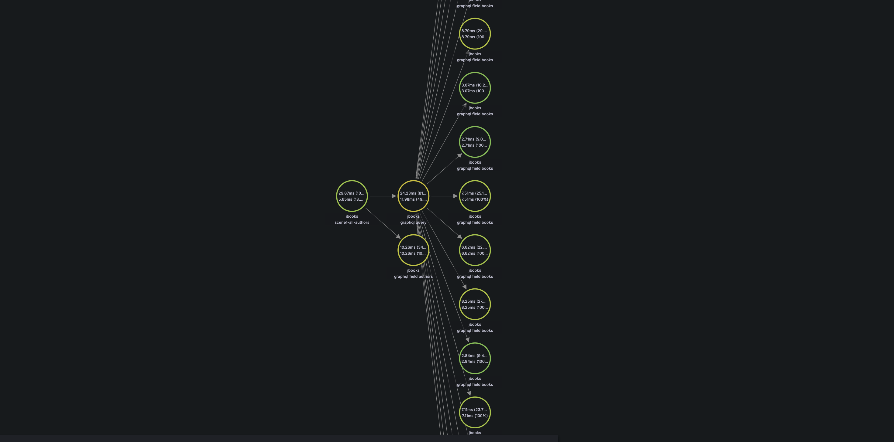
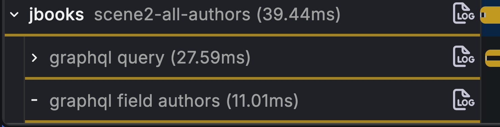
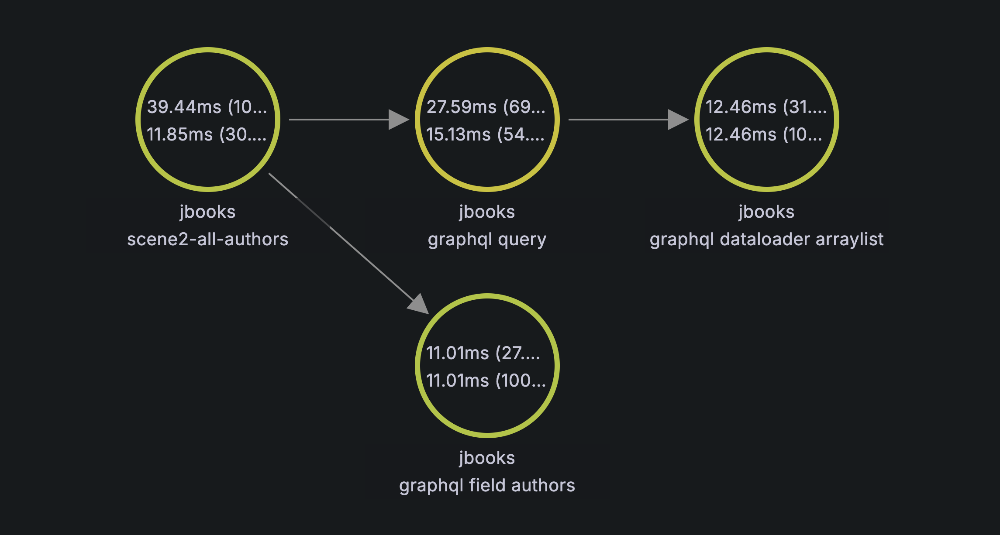

# Hands-on GraphQL — N+1 with Observability

A Spring Boot GraphQL demo that reproduces the classic **N+1 query problem** on an `Author → Books` (1:N) relationship,
compares two resolution strategies, and verifies the fix with **Hibernate SQL counting** and **Grafana Tempo distributed
tracing**.

## Test Data

`DataLoader` seeds the database at startup:

- **20** Authors (`Author 1` … `Author 20`)
- **5** Books per Author (**100** books total)

```java
for(int i = 1;
i <=20;i++){ /* save author */ }
        for(
Author author :authors){
        for(
int i = 1;
i <=5;i++){ /* save book */ }
        }
```

## What This Project Demonstrates

| Scene       | Profile  | Mechanism        | Books resolution                       |
|-------------|----------|------------------|----------------------------------------|
| **Scene 1** | `scene1` | `@SchemaMapping` | One SQL query **per Author** (N+1)     |
| **Scene 2** | `scene2` | `@BatchMapping`  | One batched `IN` query for all Authors |

Switch scenes via Spring Profile—no code changes required between experiments.

## Prerequisites

- Java 25+
- Maven 3.9+
- Docker & Docker Compose

## Quick Start

### 1. Start infrastructure

```bash
docker compose up -d postgres grafana-lgtm
```

| Service           | URL / Port                                          |
|-------------------|-----------------------------------------------------|
| PostgreSQL        | `localhost:5432` (db: `jbooks`, user/pass: `admin`) |
| Grafana           | http://localhost:3000                               |
| Tempo OTLP (HTTP) | `localhost:4318`                                    |

> **Important:** Ports `4317` and `4318` must be mapped in `compose.yml` so tests and the app can export traces to
> Tempo.

### 2. Run the application

```bash
# Scene 1 (N+1 baseline)
mvn spring-boot:run -Dspring-boot.run.profiles=scene1,tracing

# Scene 2 (batch — default in application.yml)
mvn spring-boot:run
```

GraphiQL: http://localhost:8080/graphiql

Example query:

```graphql
query AuthorsWithBooks {
   authors {
      id
      name
      books {
         id
         title
      }
   }
}
```

### 3. Run tracing tests

Four test cases (two per scene). Trace names in Grafana are kept **short** so they fit the UI:

| Case  | Test method                        | Grafana trace name       | Query                           | Expected SQL            |
|-------|------------------------------------|--------------------------|---------------------------------|-------------------------|
| 1     | `singleAuthorWithBooks_*` (scene1) | `scene1-single-author`   | `author(id: 1) { books { … } }` | **2–3**                 |
| **2** | `allAuthorsWithBooks_*` (scene1)   | **`scene1-all-authors`** | `authors { books { … } }`       | **21–30** (1 + N, N=20) |
| 1     | `singleAuthorWithBooks_*` (scene2) | `scene2-single-author`   | `author(id: 1) { books { … } }` | **2–4**                 |
| **2** | `allAuthorsWithBooks_*` (scene2)   | **`scene2-all-authors`** | `authors { books { … } }`       | **2–4**                 |

```bash
mvn test -Dtest=AuthorBooksScene1TracingTest
mvn test -Dtest=AuthorBooksScene2TracingTest
```

Each test logs a **Trace ID** and **SQL count**. Paste the Trace ID into **Grafana → Explore → Tempo**, or search by
trace name (e.g. `scene1-all-authors`).

Tests connect to the external Postgres from Compose (not Testcontainers) for faster local iteration.

## Project Layout

```
src/main/java/dev/danvega/jbooks/
├── author/
│   ├── AuthorController.java                    # authors / author(id) queries
│   ├── AuthorBooksSchemaMappingController.java  # scene1: per-author books
│   └── AuthorBooksBatchMappingController.java   # scene2: batched books
├── book/BookRepository.java                     # findByAuthorId / findByAuthorIdIn
└── DataLoader.java                              # seeds 20 authors × 5 books

src/test/java/dev/danvega/jbooks/author/
├── AuthorBooksTracingTestSupport.java           # GraphQL call + SQL stats + trace span
├── AuthorBooksScene1TracingTest.java            # scene1-single-author, scene1-all-authors
└── AuthorBooksScene2TracingTest.java            # scene2-single-author, scene2-all-authors

src/main/resources/
├── application-tracing.yml    # OTLP export to Tempo
└── graphql/schema.graphqls
```

## How We Measure

**1. SQL count (quantitative)**  
Hibernate statistics (`generate_statistics: true`) count prepared statements per GraphQL request. This is the primary
metric—especially on localhost where latency is misleading.

With **N = 20 Authors**:

- Scene1 all-authors (`scene1-all-authors`): **1 + N ≈ 21** prepared statements
- Scene2 all-authors (`scene2-all-authors`): **≈ 2** prepared statements

**2. Distributed traces (qualitative)**  
OpenTelemetry exports spans to Grafana Tempo:

- `graphql query` — entire GraphQL request
- `graphql field books` — scene1: repeated per Author (N+1 visible in trace)
- `graphql dataloader …` — scene2: one batch span for all books

Root span names match the scenario: `scene1-all-authors`, `scene2-all-authors`, etc.

---

## Grafana: Case 2 — All Authors (Multi-Author Comparison)

**Case 2** loads all **20 Authors** and nested `books` — this is where N+1 vs Batch differs most clearly. Compare *
*scene1** and **scene2** side by side in Grafana.

### Case 2 × Scene 1 — `scene1-all-authors` (N+1)

**What to expect**

- SQL count: **~21** (1 × `authors` + 20 × `books` per author)
- Trace shape: many **`graphql field books`** spans (one per Author)
- Duration on localhost may be similar to scene2 — focus on **span count** and **SQL count**, not latency alone

**Trace duration (Waterfall)**

<!-- Paste Grafana Trace Waterfall screenshot for scene1-all-authors -->


> **[Screenshot: Trace Waterfall — `scene1-all-authors`]**
>
> *Annotate: root span duration, `graphql query`, repeated `graphql field books`, SQL count from test log.*

**Node graph**

<!-- Paste Grafana Node graph screenshot for scene1-all-authors -->


> **[Screenshot: Node Graph — `scene1-all-authors`]**
>
> *Annotate: total time % of trace, self time, critical path through `graphql field books`.*

---

### Case 2 × Scene 2 — `scene2-all-authors` (Batch)

**What to expect**

- SQL count: **~2–4** (1 × `authors` + 1 × batched `books IN (...)`)
- Trace shape: **one** **`graphql dataloader`** span instead of 20 `graphql field books`
- Same GraphQL response size (20 authors × 5 books); fewer DB round-trips

**Trace duration (Waterfall)**

<!-- Paste Grafana Trace Waterfall screenshot for scene2-all-authors -->


> **[Screenshot: Trace Waterfall — `scene2-all-authors`]**
>
> *Annotate: root span duration, single `graphql dataloader` span, compare total time to scene1.*

**Node graph**

<!-- Paste Grafana Node graph screenshot for scene2-all-authors -->


> **[Screenshot: Node Graph — `scene2-all-authors`]**
>
> *Annotate: total time % of trace, self time on `graphql dataloader`, contrast with scene1 node count.*

---

## Documentation

| Document                                                                                   | Description                  |
|--------------------------------------------------------------------------------------------|------------------------------|
| [docs/n-plus-one-graphql-tracing-study-en.md](docs/n-plus-one-graphql-tracing-study-en.md) | Full write-up (if present)   |
| [docs/n-plus-one-graphql-tracing-study.md](docs/n-plus-one-graphql-tracing-study.md)       | Chinese version (if present) |

## Conclusions

1. **N+1 means 1 + N SQL round-trips**, where **N is the number of parent ("one") entities**—not the number of child
   rows. With **20 Authors** in this repo, scene1 issues **~21 queries** (1 + 20). Each Author has 5 books; that affects
   result size per query, not N.

2. **GraphQL makes N+1 easy to trigger.** A single nested query (`authors { books { … } }`) causes the server to resolve
   `books` once per Author unless batching is in place.

3. **`@BatchMapping` is the Spring GraphQL fix.** Scene2 collapses N book lookups into one `findByAuthorIdIn(...)` call
   plus in-memory grouping—reducing SQL from **1 + N (~21) to ~2**.

4. **Count SQL, don't trust local latency.** On a single machine with Docker Postgres on `localhost`, network cost is
   near zero and small repeated queries can look as fast as (or faster than) one large batch query. End-to-end trace
   duration is noisy (JVM, GC, serialization). **Prepared statement count** and **trace shape** are the reliable
   signals.

5. **Traces make N visible.** In Case 2, `scene1-all-authors` shows repeated `graphql field books` spans;
   `scene2-all-authors` shows a single `graphql dataloader` span. This confirms that **N tracks the Author count (20)**
   in the 1:N relationship.

6. **Batch is not free.** Scene2 trades N round-trips for one result set of 100 books and CPU spent on `groupingBy`.
   That trade-off pays off in production (remote DB, connection pools, concurrency)—not always on localhost.

7. **Two "DataLoader" names are unrelated.** `dev.danvega.jbooks.DataLoader` seeds data at startup (
   `CommandLineRunner`). The `graphql dataloader` span comes from graphql-java's batching layer behind `@BatchMapping`.

---

**Bottom line:** Use `scene1-all-authors` to see the problem (SQL count and trace spans scale with Author count), use
`scene2-all-authors` to fix it (constant ~2 SQL), and use Grafana Tempo Waterfall + Node graph to *see* the
difference—not just count it.
